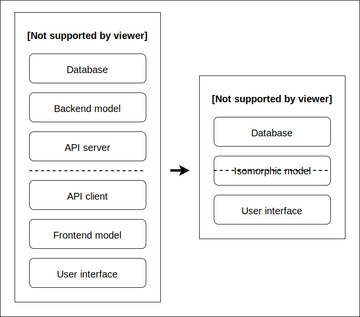

<p align="center">
	
	<br>
	<br>
</p>

> Build a frontend/backend application as easy as a standalone application.

## Introduction

Building a full web app is painful. We have to worry about the frontend, the backend, the database, and all these layers have to be connected. Additional layers are required to connect the frontend and the backend. So we put a REST or GraphQL API in the middle, and since we have to implement it in both the frontend and the backend, it adds two additional layers.

Eventually, our well-architected application is composed of six layers: user interface, frontend model, API client, API server, backend model, and database. So every time we want to implement a new feature, we have to make changes in six different places. Conceptually, it is not complicated, but it is cumbersome.

Layr allows reducing the number of layers from six to three. First, we get rid of the API layers, and then we unify the frontend and backend models into what we call an "isomorphic model":

<p align="center">
	
</p>

Don't be intimidated by the term "isomorphic model", it is simple. It means that a model can live in different contexts (i.e., the frontend and the backend). And by adding some polymorphism (i.e., class inheritance), the model can change its shape and behave differently depending on the context it lives in. So, in fact, we will have two distinct models, one in the frontend and one in the backend, but they are two variations of the same thing.

To better understand, let's build a simple "counter" app involving a frontend and a backend.

First, we need some shared code between the frontend and the backend:

`shared.js`:

```js
import {Document, field} from '@layr/document';

export class BaseCounter extends Document {
  // The shared class define a field to keep track of the counter's value
  @field('number') value = 0;
}
```

Then, let's build the backend:

`backend.js`:

```js
import {Layer, LayerHTTPServer, expose} from '@layr/layer';

import {BaseCounter} from 'shared';

@expose()
class Counter extends BaseCounter {
  // The counter's value can be exposed to the frontend
  @expose() value;

  // The backend implements and exposes the "business logic"
  @expose() increment() {
    this.value++;
  }
}

// We register the backend class into a layer
const layer = new Layer({Counter});

// And we serve the layer through HTTP
const server = new LayerHTTPServer(layer);
await server.run();
```

Finally, let's build the frontend:

`frontend.js`:

```js
import {Layer, LayerHTTPClient} from '@layr/layer';

import {BaseCounter} from 'shared';

class Counter extends BaseCounter {
  // For now, the frontend class is nothing more than the base class
}

// We connect to the backend layer
const backendLayer = await new LayerHTTPClient('https://backend.mycounter.com');

// We register the frontend class into a layer and we set the backend layer as parent
const layer = new Layer({Counter}, {parent: backendLayer});

// Lastly, we consume it
const counter = new layer.Counter();
await counter.increment();
console.log(counter.value); // => 1
```

This is it. By invoking `counter.increment()`, we get the counter's value incremented. Notice that the `increment()` method is not implemented in the frontend class or the shared class. It only exists in the backend class. So, how is it possible that we could call it from the frontend? It is because the frontend class is registered in a layer that has the backend as a parent. When a method is missing in the frontend, and a method with the same name is exposed in the backend, it is automatically invoked.

From the frontend point of view, the operation is transparent. It doesn't need to know that some methods are invoked remotely. It just works. The current state of an instance (i.e., `counter`'s attributes) is automatically transported back and forth. When a method is executed in the backend, it has access to all attributes of the frontend's instance. And inversely, when some attributes change in the backend, they are automatically reflected in the frontend.

How about returning values from a remotely invoked method? It is possible to `return` anything that is serializable, including instances of the current class or any other class. As long as a class is registered with the same name in both the frontend and the backend, instances are automatically transported.

How about overriding a method across the frontend and the backend? It's no different than with regular JavaScript; we use `super`. For example, we could override the `increment()` method to run additional code in the context of the frontend:

`frontend.js`:

```js
class Counter extends BaseCounter {
  async increment() {
    await super.increment(); // Backend's `increment()` method is invoked
    console.log(this.value); // Additional code is executed in the frontend
  }
}
```

To put it simply, it is as if there is no separation between frontend and backend. When a local class inherits from a remote class through a parent layer, the methods are executed locally or remotely depending on where they are implemented, and all instance's attributes are automatically transported.

Building a frontend/backend application becomes as easy as building a standalone application.

This is Layr.

## Guide

TODO

## Reference

TODO

## License

MIT
