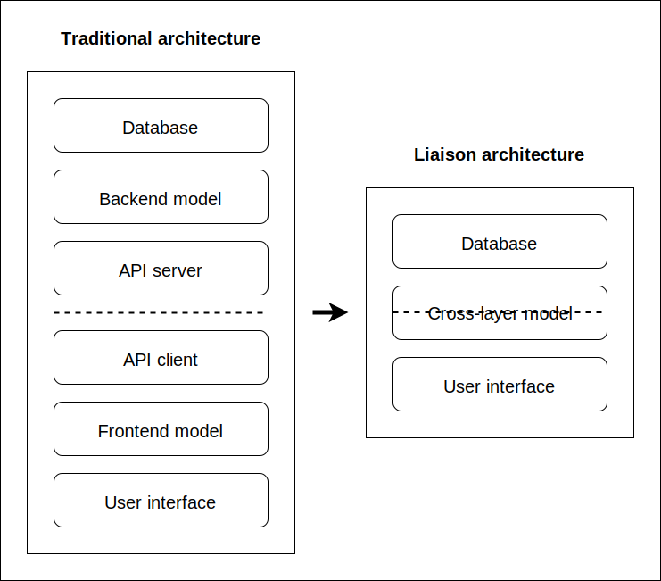

<p align="center">
	
	<br>
	<br>
</p>

> A love story between the frontend and the backend.

## Introduction

Building a full-stack web app is painful. We have to worry about the frontend, the backend, the database, and all these layers have to be connected. So additional layers are usually required. We put a REST or GraphQL API between the frontend and the backend, and since we have to implement it on both sides, it adds two additional layers.

Eventually, our well-architected application is composed of six layers: user interface, frontend model, API client, API server, backend model, and database. So every time we want to implement a new feature, we have to make changes in six different places. Conceptually, it is not complicated, but it is certainly cumbersome.

Liaison allows reducing the number of layers from six to three. First, we get rid of the API layers, then we unify the frontend and backend models into what we call a "cross-layer model":

<p align="center">
	
</p>

Don't be intimidated by the term "cross-layer model". It just means that a model can run in different contexts (i.e., the frontend and the backend layers), and by using polymorphism, it can change its shape and behavior depending on the context it runs in. So, in reality, we will have two distinct models, one in the frontend and one in the backend, but they are two variations of the same base model.

To better understand, let's build a simple "counter" app involving a frontend and a backend.

First, we need some shared code between the frontend and the backend:

`shared.js`:

```js
import {Entity, field} from '@liaison/liaison';

export class Counter extends Entity {
  // The shared class defines a field to keep track of the counter's value
  @field('number') value = 0;
}
```

Then, let's build the backend:

`backend.js`:

```js
import {Layer, field, method} from '@liaison/liaison';

import {Counter as BaseCounter} from './shared';

class Counter extends BaseCounter {
  // We expose the counter's value to the frontend
  @field({expose: {get: true, set: true}}) value;

  // We expose the "business logic" as well
  @method({expose: {call: true}}) increment() {
    this.value++;
  }
}

// We register the backend class into a layer
export const backendLayer = new Layer({Counter});
```

Finally, let's build the frontend:

`frontend.js`:

```js
import {Layer} from '@liaison/liaison';

import {Counter as BaseCounter} from './shared';
import {backendLayer} from './backend';

class Counter extends BaseCounter {
  // For now, the frontend class is nothing more than the base class
}

// We register the frontend class into a layer that is a child of the backend
const frontendLayer = new Layer({Counter}, {parent: backendLayer});

// Lastly, we consume it
const counter = new frontendLayer.Counter();
await counter.increment();
console.log(counter.value); // => 1
```

What's going on? By invoking `counter.increment()`, we get the counter's value incremented. Notice that the `increment()` method is not implemented in the frontend class or the shared class. It only exists in the backend. So, how is it possible that we could call it from the frontend? This is because the frontend class is registered in a layer that is a child of the backend layer. When a method is missing in the frontend, and a method with the same name is exposed in the backend, it is automatically invoked.

We get some kind of cross-layer class inheritance:

<p align="center">
	
</p>

From the frontend point of view, the operation is transparent. It doesn't need to know that some methods are invoked remotely. It just works. The current state of an instance (i.e., `counter`'s attributes) is automatically transported back and forth. When a method is executed in the backend, it receives the attributes of the frontend's instance. And inversely, when some attributes change in the backend, they are reflected in the frontend.

How about returning values from a remotely invoked method? It is possible to `return` anything that is serializable, including instances of the current class or any other class. As long as a class is registered with the same name in both the frontend and the backend, its instances are automatically transported.

> Note that in this simple example, the backend is not exactly remote. Both the frontend and the backend run in the same JavaScript runtime. To make the backend truly remote, we can expose it through HTTP. See an [example here](examples/counter-via-http).

How about overriding a method across the frontend and the backend? It's no different than with regular JavaScript; we use `super`. For example, we may override the `increment()` method to run additional code in the context of the frontend:

`frontend.js`:

```js
class Counter extends BaseCounter {
  async increment() {
    await super.increment(); // Backend's `increment()` method is invoked
    console.log(this.value); // Additional code is executed in the frontend
  }
}
```

To put it simply, it is like there is no physical separation between frontend and backend. When a local class "inherits" from a remote class through a parent layer, methods are executed locally or remotely depending on where they are implemented, and all instance's attributes are automatically transported.

Building a client/server application becomes as easy as building a standalone one.

In a nutshell, this is Liaison.

## Guide

TODO

## Reference

TODO

## License

MIT
